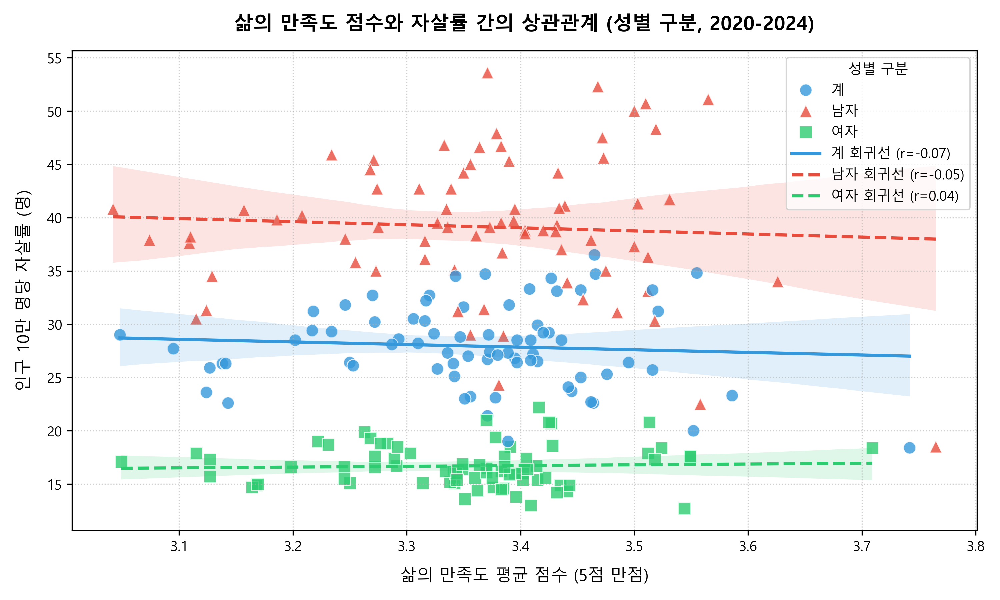
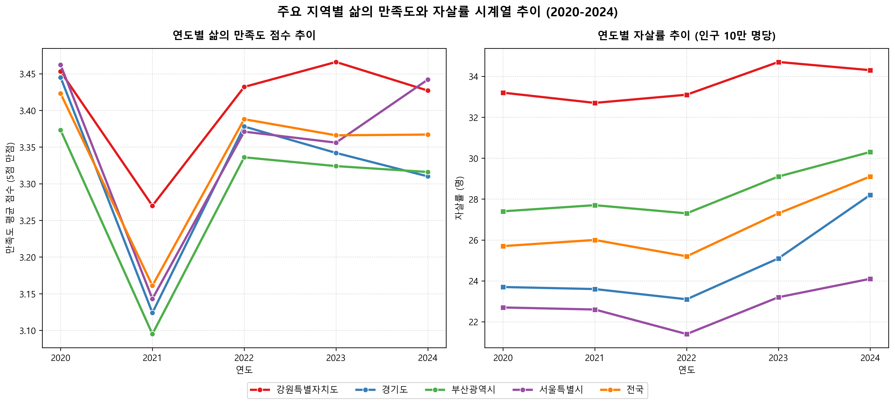
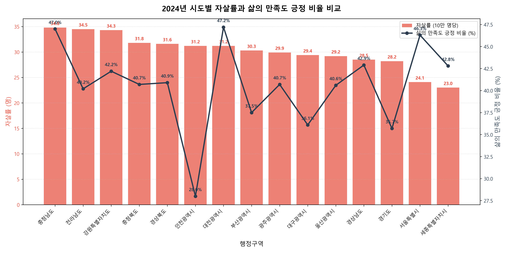
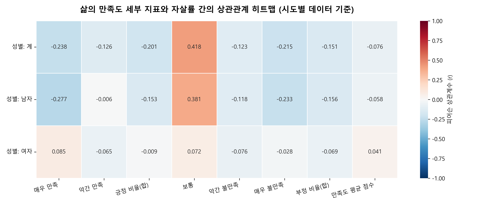

# 삶의 만족도와 자살률 간의 상관관계 분석 보고서 (2020-2024)

본 보고서는 국가통계포털(KOSIS)의 「사회조사」 내 **'삶의 만족도(시도)'** 데이터와 「사망원인통계」 내 **'인구 십만 명당 자살률(시도)'** 데이터를 바탕으로, 대한민국 17개 시도별 삶의 만족도와 자살률 간의 상호 연관성을 실증적으로 분석한 결과입니다.

---

## 1. 요약 (Executive Summary)

- **전체 상관관계 미약**: 5개년(2020~2024년) 및 17개 시도 데이터를 통합 분석한 결과, 주관적 삶의 만족도 평균 점수와 자살률 간의 전반적인 상관관계는 매우 약하게 나타났습니다 (Pearson $r = -0.0688$, 통계적 유의성 없음).
- **시계열적 특이점 (2020년 코로나19시기)**: 코로나19 대유행 첫해인 **2020년에는 시도별 삶의 만족도와 자살률 간의 뚜렷한 음(-)의 상관관계가 관찰**되었습니다 ($r = -0.5778$, $p < 0.05$). 이는 삶의 만족도가 높은 지역일수록 자살률이 통계적으로 유의미하게 낮았음을 보여줍니다. 
- **최근 연도의 역설 (2024년)**: 2024년 데이터에서는 삶의 만족도가 높은 지역(예: 충청남도)이 오히려 자살률도 높은 현상이 나타나며, 특히 **불만족 비율(부정 비율)이 높은 지역이 자살률이 더 낮게 나타나는 역설적인 경향**이 관찰되었습니다 ($r = -0.4816$, $p = 0.069$, 한계적 유의성).
- **시사점**: 주관적인 설문조사 기반의 '삶의 만족도'와 사회 구조적 지표인 '자살률'은 장기적으로 일대일 대응하지 않으며, 자살률은 고령화 비율, 사회적 고립도, 경제적 취약성 등 인구 통계학적 및 구조적 요인에 더 강력하게 종속됨을 시사합니다.

---

## 2. 데이터 개요 및 분석 방법론

### A. 데이터 출처 및 구성
1. **삶의 만족도 데이터**
   - **출처**: 국가데이터처 「사회조사」 (홀수년 기준 조사이나 본 통계표는 연도별 가공자료 포함)
   - **조사 대상**: 전국 17개 시도별 만 13세 이상 가구원
   - **척도**: 5단계 척도 ('매우 만족', '약간 만족', '보통', '약간 불만족', '매우 불만족') 응답 비율 (%)
   - **분석 기간**: 2020년 ~ 2024년 (5개년)
2. **자살률 데이터**
   - **출처**: 국가데이터처 「사망원인통계」
   - **지표**: 인구 10만 명당 자살사망률 (명)
   - **분석 기간**: 2020년 ~ 2024년 (5개년)

### B. 분석 지표 정의
- **삶의 만족도 평균 점수 (Likert-5 Score)**: 주관적 삶의 만족도를 정량화하기 위해 다음과 같이 가중평균 점수를 산출하였습니다 (5점 만점).
  $$\text{만족도 평균 점수} = \frac{(5 \times \text{매우 만족}) + (4 \times \text{약간 만족}) + (3 \times \text{보통}) + (2 \times \text{약간 불만족}) + (1 \times \text{매우 불만족})}{100}$$
- **긍정 비율 (Positive Rate, %)**: '매우 만족' + '약간 만족' 비율의 합
- **부정 비율 (Negative Rate, %)**: '매우 불만족' + '약간 불만족' 비율의 합
- **상관분석 기법**: 피어슨 상관계수(Pearson $r$) 및 스피어만 순위상관계수(Spearman $\rho$) 활용

---

## 3. 주요 분석 결과

### A. 종합 상관관계 분석
전체 관측치(17개 시도 $\times$ 5개년 $\times$ 3개 성별그룹 = 240개 데이터 포인트)를 기준으로 분석한 결과입니다.

| 분석 지표 쌍 (vs 자살률) | 피어슨 상관계수 (Pearson $r$) | p-value (유의확률) | 결과 해석 |
| :--- | :---: | :---: | :--- |
| **만족도 평균 점수** | $-0.0688$ | $0.5445$ | 상관관계 거의 없음 (유의하지 않음) |
| **만족도 긍정 비율 (%)** | $-0.1948$ | $0.0833$ | 약한 음의 상관관계 (한계적 유의성) |
| **만족도 부정 비율 (%)** | $-0.1544$ | $0.1715$ | 상관관계 거의 없음 (유의하지 않음) |

> [!NOTE]
> 전체 데이터를 통합했을 때는 만족도가 높을 때 자살률이 낮아지는 경향(음의 상관관계)이 매우 미약하게 나타납니다. 이는 연도별, 지역별 편차가 크기 때문입니다.

---

### B. 성별에 따른 상관관계 편차
남성과 여성 집단을 구분하여 만족도 점수와 자살률 간의 상관관계를 구했습니다.

| 성별 집단 | 피어슨 상관계수 ($r$) | 스피어만 순위상관계수 ($\rho$) | p-value (피어슨) |
| :---: | :---: | :---: | :---: |
| **전체 (계)** | $-0.0688$ | $-0.0545$ | $0.5445$ |
| **남성** | $-0.0509$ | $0.0027$ | $0.6539$ |
| **여성** | $0.0403$ | $-0.0258$ | $0.7227$ |

남성과 여성 모두 주관적 삶의 만족도와 자살률 간의 직접적인 상관관계는 통계적으로 유의미하지 않았습니다. 이는 주관적으로 느끼는 삶의 만족감이 실제 자살률의 성별 편차를 설명하기에는 충분하지 않음을 보여줍니다.

---

### C. 연도별 지역 상관관계 변화 (역설적 흐름)
각 연도별로 17개 시도의 만족도 점수와 자살률 간의 상관관계를 별도로 분석하였습니다. 여기서는 매우 흥미로운 변화 패턴이 나타납니다.

| 연도 | 만족도 평균 점수 vs 자살률 ($r$) | 부정 비율(불만족) vs 자살률 ($r$) | 특이사항 및 해석 |
| :---: | :---: | :---: | :--- |
| **2020년** | **$-0.5778$ ($p = 0.0241$)** | $0.1486$ | **통계적으로 유의미한 음(-)의 상관관계**. 만족도 높은 지역이 자살률이 낮았음. |
| **2021년** | $0.0603$ | $-0.3707$ | 상관관계 부재. 불만족 비율과 자살률 간 음의 상관 경향성 시작. |
| **2022년** | $0.0944$ | $-0.2415$ | 상관관계 미약. |
| **2023년** | $-0.1205$ | $0.0550$ | 상관관계 미약. |
| **2024년** | $0.1786$ | **$-0.4816$ ($p = 0.0691$)** | **역설적 흐름**. 불만족(부정) 비율이 높을수록 오히려 자살률이 낮은 한계 유의적 경향성. |

- **2020년의 패턴**: 기존 직관과 일치합니다. 주관적으로 살기 좋다고 느끼는 지역(세종, 서울 등)이 실제 자살률도 낮았습니다.
- **2024년의 역설**: 불만족 비율이 높은 지역(예: 대구 21.4%, 세종 20.8%)은 자살률이 낮거나 평균 수준인 반면, 불만족 비율이 현저히 낮은 지역(예: 충청남도 6.2%)의 자살률이 34.8명으로 가장 높은 기현상이 발생했습니다.

---

## 4. 시각화 자료 분석

분석 결과를 종합적으로 시각화한 4종의 그래프입니다.

### ① 성별 산점도 및 회귀 분석 그래프
17개 시도의 연도별 데이터를 점으로 나타내고 성별 회귀선을 도출한 그래프입니다. 전체, 남성, 여성 모두 회귀선의 기울기가 거의 평평하여 상관관계가 없음을 직관적으로 보여줍니다.

---

### ② 주요 지역별 삶의 만족도 및 자살률 시계열 추이
전국 평균 및 서울, 부산, 경기, 강원 등 주요 시도의 5개년 변화를 보여줍니다.
- **자살률의 구조적 안정성**: 자살률은 지역별 순위(강원 > 부산 > 전국 > 경기 > 서울)가 5년 내내 거의 일정하게 유지되는 구조적 고착성을 보입니다.
- **만족도의 가변성**: 반면 삶의 만족도는 연도별 조사에 따라 변동 폭이 크며, 자살률의 고착된 구조를 따라가지 못합니다.

---

### ③ 2024년 시도별 자살률 및 삶의 만족도 긍정 비율 비교
2024년 기준 16개 시도(세종 포함)의 자살률(막대, 내림차순)과 만족도 긍정 비율(꺾은선)을 매핑한 이중 축 그래프입니다. 자살률 최상위권인 충청남도(34.8명)의 삶의 만족도 긍정 비율(47.0%)이 서울(46.3%)이나 세종(42.8%)보다 오히려 높은 수준을 보여주며 역설적 양상을 시각화합니다.

---

### ④ 삶의 만족도 세부 응답 지표와 자살률 간의 상관관계 히트맵
만족도 설문의 5단계 응답 비율 및 가중 점수와 자살률 간의 피어슨 상관계수를 성별로 계산한 히트맵입니다. 
- 파란색은 양(+), 빨간색은 음(-)의 상관관계를 나타냅니다.
- '긍정 비율(합)'은 전반적으로 자살률과 음의 관계($-0.2$ 내외)를 보이나, 세부 만족도 지표들은 성별에 따라 다소 파편화된 양상을 보여 직접적인 인과관계를 설명하기 어렵습니다.

---

## 5. 지자체별 5개년 평균 비교분석

5개년(2020~2024년) 평균 데이터를 기준으로 정렬한 지역별 순위표입니다.

| 순위 | 행정구역 (지역) | 5개년 평균 자살률 (명) | 만족도 평균 점수 (5점) | 긍정 비율 (%) | 부정 비율 (%) |
| :---: | :--- | :---: | :---: | :---: | :---: |
| 1 | **충청남도** | **34.28** | 3.444 | 43.32 | 11.14 |
| 2 | **강원특별자치도** | **33.60** | 3.410 | 43.64 | 13.54 |
| 3 | **충청북도** | **30.60** | 3.359 | 40.92 | 14.44 |
| 4 | **전라남도** | **29.80** | 3.376 | 41.06 | 13.44 |
| 5 | **경상북도** | **29.30** | 3.278 | 36.94 | 16.02 |
| 6 | **울산광역시** | **28.62** | 3.337 | 40.16 | 15.70 |
| 7 | **부산광역시** | **28.36** | 3.289 | 38.04 | 16.36 |
| 8 | **대전광역시** | **27.96** | 3.435 | 45.70 | 13.42 |
| 9 | **인천광역시** | **27.64** | 3.287 | 36.12 | 15.64 |
| 10 | **대구광역시** | **27.38** | 3.250 | 35.82 | 18.52 |
| 11 | **경상남도** | **27.06** | 3.358 | 41.68 | 14.24 |
| 12 | **광주광역시** | **26.24** | 3.394 | 42.28 | 13.24 |
| 13 | **경기도** | **24.74** | 3.320 | 39.44 | 16.24 |
| 14 | **서울특별시** | **22.80** | 3.355 | 42.38 | 15.70 |
| 15 | **세종특별자치시** | **20.74** | **3.524** | **50.74** | 14.10 |

### 주요 관찰 특징
1. **고위험 지역 (자살률 최고)**:
   - **충청남도 및 강원특별자치도**는 5개년 평균 자살률이 각각 34.28명, 33.60명으로 압도적 1, 2위를 차지했습니다. 
   - 그러나 이들 지역의 삶의 만족도 점수(충남 3.444, 강원 3.410) 및 긍정 비율은 전국 평균 이상입니다.
2. **저위험 지역 (자살률 최저)**:
   - **세종특별자치시**는 평균 자살률이 20.74명으로 가장 낮았으며, 동시에 삶의 만족도 평균 점수(3.524)와 긍정 비율(50.74%)이 압도적으로 높았습니다.
   - **서울특별시** 역시 자살률이 22.80명으로 매우 낮은 편에 속합니다.
3. **불만족의 역설**:
   - **대구광역시**는 삶의 만족도 점수(3.250)가 가장 낮고 부정(불만족) 비율(18.52%)이 가장 높았지만, 자살률은 27.38명으로 전국의 하위권(안정적)에 머물렀습니다.

---

## 6. 심층 인사이트 및 정책적 시사점

### ① '만족도 설문'과 '자살률' 괴리의 원인
- **평균값의 함정 (인구 구조적 요인)**: 사회조사의 삶의 만족도는 지역 전체 인구의 평균적 정서를 반영하는 반면, 자살률은 사회적 최약층이나 특정 취약 집단(예: 경제적 빈곤 독거노인)에 극단적으로 집중되는 경향이 있습니다. 농어촌 비율이 높은 **충청남도, 강원도, 전라남도 등은 심각한 노인 빈곤 및 노인 자살률**로 인해 전체 자살률이 높게 유지되지만, 사회조사 표본의 다수를 차지하는 일반 주민들의 주관적 삶의 만족도는 높게 응답될 수 있습니다.
- **지역 인구 구성의 젊음**: 세종특별자치시와 서울특별시는 상대적으로 젊은 생산가능인구 및 고학력 직장인 비율이 높아 노인 자살률의 영향이 적습니다. 이로 인해 세종시는 높은 삶의 만족도와 낮은 자살률이라는 이상적 지표를 보여줍니다.

### ② 2020년과 2024년의 차이 분석
- **2020년 (코로나19 유행 초기)**: 사회적 재난이 닥쳤을 때 공동체의 주관적 정서적 붕괴가 즉각적으로 취약층의 자살 위험으로 전이되었을 가능성이 있습니다. 이 시기에는 심리적 고통(낮은 삶의 만족도)이 실제 극단적 선택률과 높은 상관성을 보였습니다.
- **2024년 (포스트 코로나 시기)**: 사회가 일상으로 회복되면서 일반적인 주관적 만족도는 경제 지표나 정서에 따라 빠르게 회복되거나 변동했지만, 고립된 취약층의 구조적인 자살 문제는 사회적 고령화 및 양극화의 고착화로 인해 쉽게 개선되지 않고 독자적인 궤적을 그리며 고착화된 것으로 해석됩니다.

### ③ 결론 및 정책 제언
자살 예방 정책은 단순히 지역 주민 전체의 삶의 만족도나 주관적 웰빙을 증진하려는 포괄적 접근(문화 공간 확대, 일반 체육시설 확보 등)만으로는 한계가 있습니다. **삶의 만족도 설문에서 감지되지 않는 사각지대 취약 계층**(특히 고령층, 1인 가구, 고립 무직 가구 등)을 타겟팅한 핀포인트 형태의 사회안전망 강화 및 긴급 의료·정서 지원 정책이 요구됩니다.
